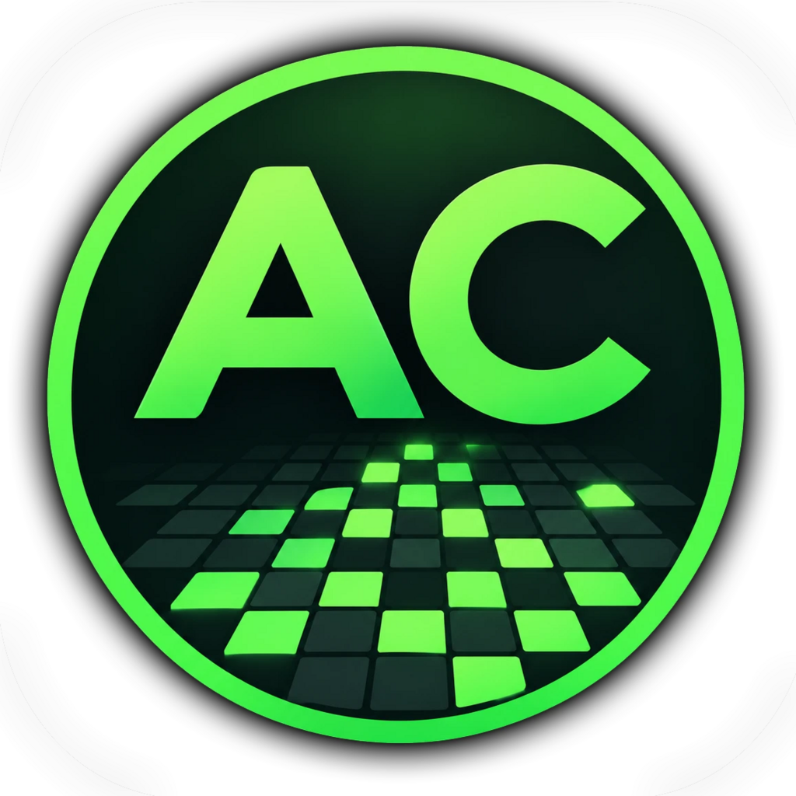

<p align="center"></p>

# AutoCell

**Zelluläre Automaten entwerfen, simulieren und auswerten** – vom klassischen
Game of Life über Staubildung im Verkehr bis zur Ausbreitung von Krankheiten.

AutoCell 2 ist eine vollständige Neuentwicklung (Version 1 wird nicht
weitergeführt) und entsteht als Desktop-Anwendung und als Web-Anwendung, die
sich in beliebige Webseiten einbinden lässt. Beide nutzen denselben Rechenkern.

## Funktionen (Stand 2.0.0, in Entwicklung)

- Mehrere Projekte gleichzeitig in Tabs, Vorlagen für den schnellen Start
- Beliebig viele **Zustände** mit Name, Farbe und Startanteil
- **Regeln** je Zustand mit Bedingungen wie
  - Anzahl der Nachbarn in bestimmten Zuständen,
  - Zustand des Nachbarn an einer festen Position (z. B. „rechts“) oder
  - Alter der Zelle (Generationen im aktuellen Zustand),

  jeweils mit „und“/„oder“ verknüpft und mit einer Wahrscheinlichkeit
- **Nachbarschaften**: Moore, Von Neumann, erweitert, Vorausschau oder frei im 7×7-Raster
- **Randbedingungen**: Torus, fester Rand, gespiegelt
- Zellen einzeln setzen (Stift, Radierer, Zellmenü per Rechtsklick), Zufallsbelegung
- **Automatische Simulation** mit einstellbarem Tempo (Gen./s oder s/Gen.),
  Einzelschritt, Zurücksetzen und automatischem Stopp bei Generation n oder stabilem/periodischem Muster
- **Statistik**: Live-Verlauf, Kennzahlen je Zustand, Mustererkennung, CSV-Export
- Eigenes Projektformat **`.acp`** ([Spezifikation](docs/acp-format.md)), Import/Export von CSV und RLE (Golly), PNG-Schnappschüsse
- Rückgängig/Wiederherstellen, Tastenkürzel
- **Im Web veröffentlichen**: Simulationen mit dem AutoCell-Player in beliebige Webseiten einbinden
- **Nostalgiemodus** (Ansicht › Nostalgiemodus): die Oberfläche des ursprünglichen Entwurfs

## Aufbau

```
packages/core     Rechenkern (TypeScript, ohne DOM): Simulation, Regeln, Statistik, .acp
packages/player   Web-Komponente <autocell-player> zum Einbinden in Webseiten
apps/autocell     Oberfläche (React + Vite) – läuft im Browser und in der Desktop-Hülle
apps/autocell/src-tauri  Desktop-Hülle (Tauri 2, Rust)
docs/             Spezifikationen
scripts/          Hilfsskripte (z. B. Versionsabgleich)
```

## Entwickeln

Voraussetzung: Node.js ≥ 20.

```bash
npm install          # Abhängigkeiten aller Pakete
npm run dev          # Oberfläche unter http://localhost:5173
npm test             # alle Tests (Rechenkern und Oberflächenlogik)
npm run typecheck    # TypeScript prüfen
npm run build        # Produktions-Build nach apps/autocell/dist
```

### Desktop-App (Tauri)

Zusätzlich nötig: [Rust](https://rustup.rs) und unter Windows die Visual Studio
C++ Build Tools (Workload „Desktopentwicklung mit C++“).

```bash
npm run desktop:dev    # Desktop-Fenster mit Live-Neuladen
npm run desktop:build  # autocell.exe und Installer unter apps/autocell/src-tauri/target/release
```

### Web-Version

Die Oberfläche läuft ohne Änderungen im Browser. Jeder Push auf `main` baut sie
über GitHub Actions (`.github/workflows/web.yml`) und veröffentlicht sie auf
GitHub Pages unter <https://delbonum.github.io/autocell/>. Der Inhalt von
`apps/autocell/dist` lässt sich ebenso auf jeden anderen statischen Webserver
legen, auch in ein Unterverzeichnis.

Im Browser öffnet und speichert AutoCell Dateien in Chrome und Edge direkt auf
der Festplatte, in Firefox und Safari per Hochladen und Herunterladen. Über das
Installieren-Symbol in der Adressleiste lässt sich die Web-Version wie eine App
in einem eigenen Fenster starten.

### AutoCell-Player

`<autocell-player>` spielt AutoCell-Projekte in jeder Webseite ab – eine
eigenständige Web-Komponente (etwa 17 KB, ohne React), die nur den Rechenkern
nutzt. In AutoCell erzeugt **Datei › Im Web veröffentlichen** den passenden
Code-Schnipsel, wahlweise mit eingebettetem Projekt oder mit Verweis auf eine
`.acp`-Datei.

```html
<script type="module" src="https://delbonum.github.io/autocell/player/autocell-player.js"></script>
<autocell-player src="mein-projekt.acp" controls autoplay></autocell-player>
```

Alle Attribute, Beispiele und die JavaScript-Schnittstelle stehen auf der
[Beispielseite](https://delbonum.github.io/autocell/player/)
(Quelle: `packages/player/demo/index.html`). `npm run build` baut den Player
mit und legt ihn unter `apps/autocell/dist/player` ab.

## Versionsnummer

Die Versionsnummer folgt [SemVer](https://semver.org/lang/de/) und wird **nur**
in der `package.json` im Wurzelverzeichnis gepflegt. Beim Bauen wird sie in die
Anwendung (Credits-Fenster, `.acp`-Dateien) eingesetzt.

```bash
npm version 2.1.0 --no-git-tag-version   # Wurzel-package.json anheben
npm run version:sync                     # in alle Pakete übertragen
```

Änderungen werden in [CHANGELOG.md](CHANGELOG.md) festgehalten.

## Nächste Schritte

- Desktop-Hülle ausbauen: native Datei-Dialoge, Installationspakete für macOS und Linux
- Web-Version offline nutzbar machen (Service Worker)
- Ausführliches Statistik-Fenster mit Messpunkten einzelner Zellen
